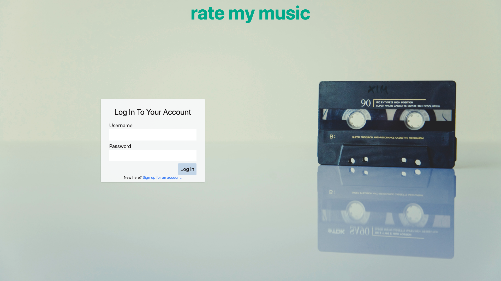
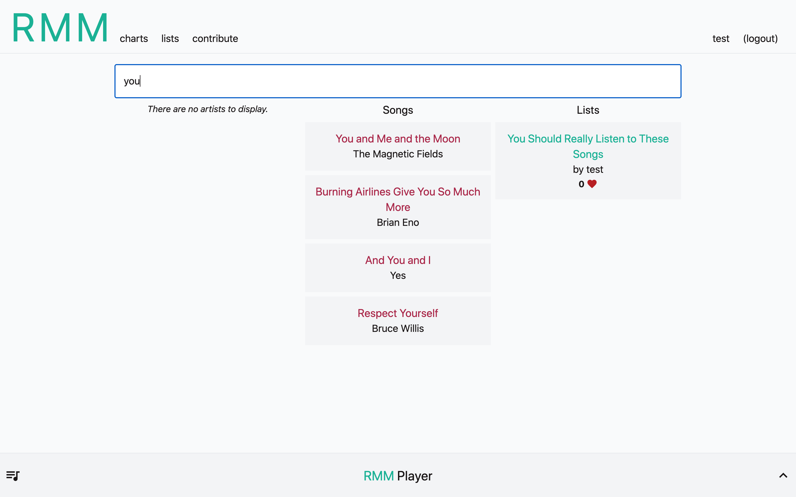
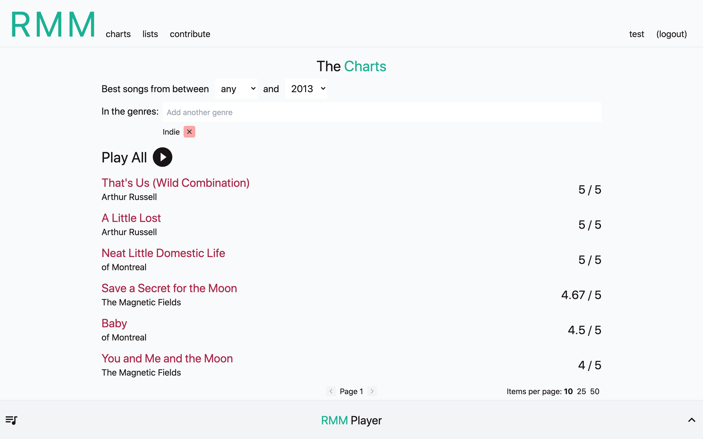
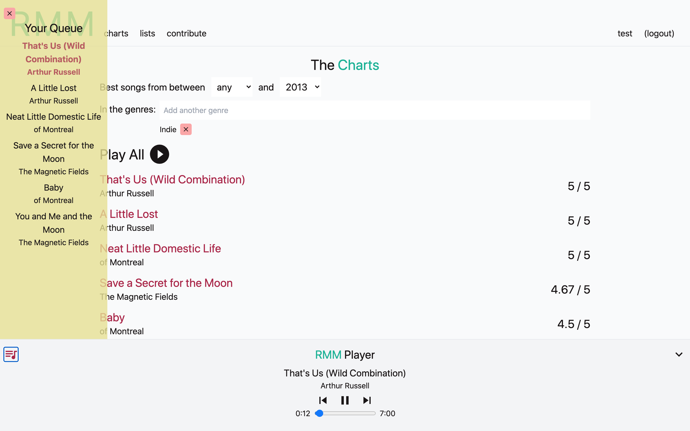
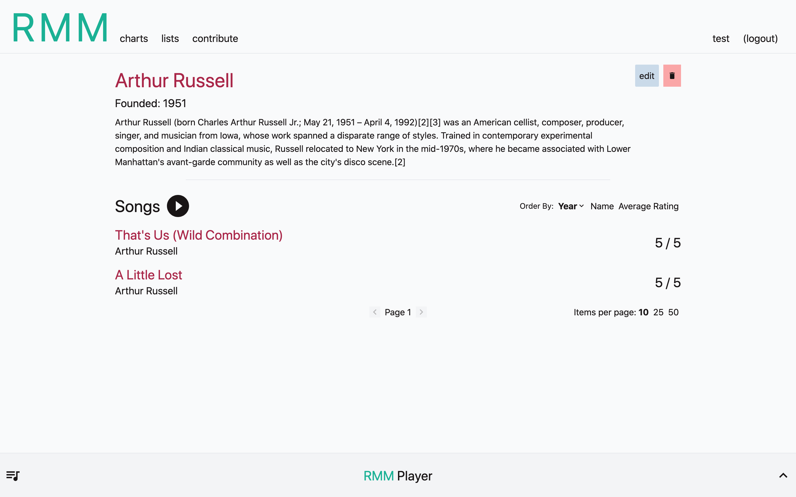
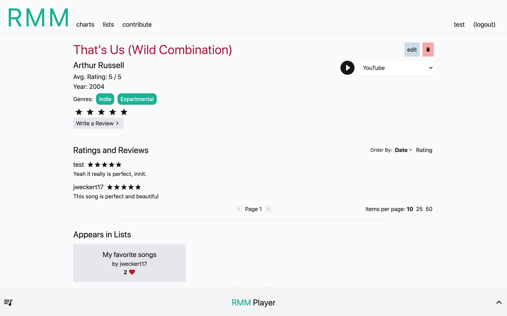

# [Rate My Music](https://ratemymusic.jacobweckert.com)

## What Is This?

Rate My Music is a one-stop site for music creators and music lovers alike! If you want to get the music you make (or the music an artist you love makes!) out and into the world, Rate Your Music is your answer. Or, if you just love exploring new music and want to check out what's out there, listen to new things, and get some new favorites, you'll find exactly what you're looking for at Rate My Music, as well!

## Features

* Add new artists, songs, and lists of songs to the site intuitively and with ease. 
* Rate and write reviews for any of the songs on the site.
* Explore all of the songs on the site through a wide variety of methods including:
    * The Charts - A list of the highest-rated songs in the site that can optionally be filtered down to show only songs for some specific year range and/or only songs classified within one or more genres.
    * Lists - User-curated lists of songs, perhaps something like "Jacob's Favorite Songs", or "Songs to Code To".
    * Artist Pages - All of the songs created by a specific artist.
    * User Profile Pages - All of the songs a particular user has rated.
* Listen to any single song or any list of songs in the site with the click of a button.
    * All song views function as in-browser playlists -- for instance, if I were looking at a Chart of the top-rated indie songs from between 2010 and 2015, at the touch of a button I could queue up all the songs on that chart to play from an in-browser player, just like I was listening to an iTunes or Spotify playlist!
    * Because the site supports YouTube, SoundCloud, Vimeo, and Dailymotion sources for songs, these playlists are functionally cross-service playlists that can seamlessly include songs from any of those sources -- wow!
    * Rate My Music will remember your queue and what song you were last listening to any time you leave the site - come and go as you please with no worries of losing your spot in that awesome list you were checking out!
    * Intuitively interact with the music player - freely skip to the next song or back to the previous song in your queue, select any arbitrary song to play from your queue, pause and play, or seek to any point in a song whenever you wish.

## Wow! How can I become a user TODAY?

It's easy! [Just go here](https://uhhhwut.onrender.com/), sign up, and go crazy!

## Screenshots

|  |
| :---: |
| Landing Page |

|  |
| :---: |
| Search for any artist, song, or list with ease. |

|  |
| :---: |
| The Charts (currently filtered to show the best indie songs from 2013 or earlier!) |

|  |
| :---: |
| The Player (at bottom of screen) and the user's queue (at left of screen) - the user clicked "Play" to listen to the Chart they created! |

|  |
| :---: |
| An Artist Page - Read some details on an artist and play their catalog! |

|  |
| :---: |
| A Song Page - Rate and/or review a song, view the song's ratings and reviews, play the song from any source that has been added for it, and see all the lists it has appeared on! |

## Technologies Used

This application was built using the [React](https://github.com/) JavaScript library, and was bootstrapped with [create-react-app](https://github.com/facebook/create-react-app). Additional packages used for the production site are: 
* [react-player](https://github.com/cookpete/react-player) - Used to play songs from user-supplied URLs.
* [react-hook-form](https://react-hook-form.com/) - Used to implement highly performant forms with validation.
* [yup](https://github.com/jquense/yup) - Used to specify validation schema to be used with react-hook-form.
* [react-icons](https://react-icons.github.io/react-icons/) - Used to easily include icons for use throughout the site.
* [react-router-dom](https://reactrouter.com/) - Used to implement client-side routing.

I wrote a full test suite of over 200 tests for this project, and found it to be an incredible experience that allowed me to always be confident that my app would continue to work as expected with any change I made! All React components I wrote have tests written against them in a corresponding `.test.js` file. I used [React Testing Library](https://testing-library.com/docs/react-testing-library/intro/) to test all of my React components, with [Jest](https://jestjs.io/) as a test runner and assertion library.

Styling was implemented using [Tailwind CSS](https://tailwindcss.com/), a highly configurable, utility-based CSS library that I really enjoyed using and will absolutely be using again!

The server uses Django REST Framework with a SQLite database. [Check out the server repo here!](https://github.com/skratz17/rate-my-music-server)

## Planning Resources

Below are links to the ERD for this project, as well as the Figma mockups I made and used as a guideline for how the UI should be implemented. 

* [ERD](https://dbdiagram.io/d/5fce88eb9a6c525a03ba26fc)
* [Figma Wireframe](https://www.figma.com/file/UAXwF0vzyIztgS9m5CSjfw/Full-Stack-Capstone?node-id=0%3A1)

## Author

Jacob Eckert - [GitHub](https://github.com/skratz17), [LinkedIn](https://www.linkedin.com/in/jacob-w-eckert/) 